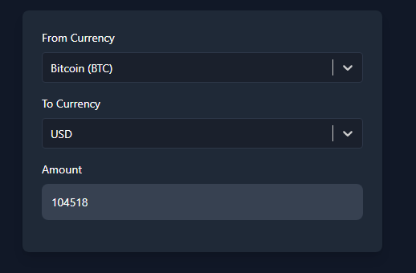

# Endpoints

`BACKEND_API_URL=http://localhost:5000/api`


## **Backend**

### **Currency**

- **Save Coins List**:  
  `POST /currency/save-coins`  
  Saves the list of supported cryptocurrencies from CoinGecko into the MongoDB database.

- **Save Supported Currencies**:  
  `POST /currency/save-supported-currencies`  
  Saves the list of supported fiat and cryptocurrency symbols from CoinGecko into the MongoDB database.

- **Get Conversion Rate**:  
  `GET /currency/convert`  
  Fetches the live conversion rate between two currencies using CoinGecko.

- **Get Tokens (Paginated)**:  
  `GET /currency/tokens`  
  Fetches the list of saved cryptocurrency tokens with pagination.

- **Get Supported Currencies (Paginated)**:  
  `GET /currency/supported-currencies`  
  Fetches the list of saved fiat and cryptocurrency symbols with pagination.

---

## **Trading**

### **Pages**

- **Currency Converter Page**:  
  Displays a currency conversion tool similar to Uniswap’s interface. It allows users to:
  - Search and select tokens.
  - Search and select fiat currencies.
  - View live conversion rates.

### **Components**

- **Selector Component**:  
  A reusable dropdown powered by `AsyncPaginate` for infinite scrolling and live searching of tokens and currencies.

- **Conversion Display**:  
  Displays the amount after fetching the conversion rate between the selected token and currency.

---

## **Example Requests**

### **Backend**

- **Save Coins List**:

  ```bash
  POST /currency/save-coins
  ```

  No request body is required.

- **Save Supported Currencies**:

  ```bash
  POST /currency/save-supported-currencies
  ```

  No request body is required.

- **Get Conversion Rate**:

  ```bash
  GET /currency/convert?from=bitcoin&to=usd
  ```

- **Get Tokens (Paginated)**:

  ```bash
  GET /currency/tokens?q=bitcoin&page=1&limit=10
  ```

- **Get Supported Currencies (Paginated)**:

  ```bash
  GET /currency/supported-currencies?q=usd&page=1&limit=10
  ```

### **Frontend**

- **Load Tokens**:

  The `Selector` component sends requests to `/currency/tokens` with query parameters for infinite scrolling.

  Example Request:

  ```bash
  GET /currency/tokens?q=ethereum&page=2&limit=50
  ```

- **Load Supported Currencies**:

  The `Selector` component sends requests to `/currency/supported-currencies` with query parameters for infinite scrolling.

  Example Request:

  ```bash
  GET /currency/supported-currencies?q=eur&page=1&limit=50
  ```

---

## **Example Responses**

### **Backend**

- **Save Coins List**:

  ```json
  {
    "message": "Coins list saved successfully"
  }
  ```

- **Save Supported Currencies**:

  ```json
  {
    "message": "Supported currencies list saved successfully"
  }
  ```

- **Get Conversion Rate**:

  ```json
  {
    "from": "bitcoin",
    "to": "usd",
    "rate": 30000
  }
  ```

- **Get Tokens (Paginated)**:

  ```json
  {
    "data": [
      { "id": "bitcoin", "name": "Bitcoin", "symbol": "btc" },
      { "id": "ethereum", "name": "Ethereum", "symbol": "eth" }
    ],
    "hasMore": true
  }
  ```

- **Get Supported Currencies (Paginated)**:

  ```json
  {
    "data": [{ "symbol": "usd" }, { "symbol": "eur" }],
    "hasMore": false
  }
  ```

---

## **Trading Implementation Notes**

- **Environment Variables**:  
  Ensure the frontend is configured with the backend API URL:

  ```env
  VITE_BACKEND_API_URL=http://localhost:5000/api/currency
  ```

- **Styling**:  
  The dropdowns and interface are styled for dark mode using TailwindCSS.

- **Error Handling**:  
  Errors in fetching data or conversions are displayed to the user in a red alert box.
